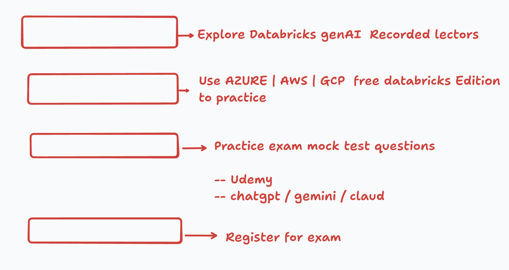

# Databricks GENAI Associates 2026

Databricks Certified GenAI Associates learning resources.

## Databricks GenAI Exam Practice Details

- [Preparations of exam and coupon codes](exam.md)

## Recorded Lectures

### The Home Page URL 

[Unlock_the_Power](https://partner-academy.databricks.com/pages/97/partner-academy-home-page)

1. [Chapter 1: Building Retrieval Agents on Databricks](https://partner-academy.databricks.com/learn/courses/2706/building-retrieval-agents-on-databricks)
2. [Chapter 2: Building Single-Agent Applications on Databricks](https://partner-academy.databricks.com/learn/courses/2716/building-single-agent-applications-on-databricks)
3. [Chapter 3: Generative AI Application Evaluation and Governance](https://partner-academy.databricks.com/learn/courses/2717/generative-ai-application-evaluation-and-governance)
4. [Chapter 4: Generative AI Application Deployment and Monitoring](https://partner-academy.databricks.com/learn/courses/2713/generative-ai-application-deployment-and-monitoring)

