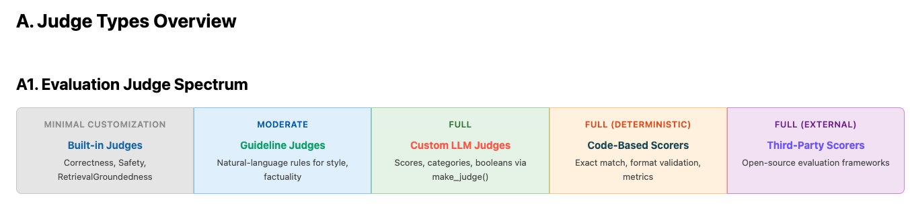

# Databricks GENAI Associates 2026

Databricks Certified GenAI Associates learning resources.

# PreRequiste 

- [Databricks fundamentals](https://partner-academy.databricks.com/learn/courses/2206/databricks-fundamentals)
- [Databricks GenAI fundamentals](https://partner-academy.databricks.com/learn/courses/1765/generative-ai-fundamentals)

## Databricks GenAI Exam Practice Details

- [Udemy Exam test and coupon codes](exam.md)
- [check recent exam details](https://www.databricks.com/learn/certification/genai-engineer-associate)

## Recorded Lectures

### The Home Page URL 

[Unlock_the_Power](https://partner-academy.databricks.com/pages/97/partner-academy-home-page)

1. [chapter 1: Building RAG Agents with Agent Bricks](https://partner-academy.databricks.com/learn/courses/5857/building-rag-agents-with-agent-bricks)

2. [Chapter 2: Building Agentic Applications on Databricks](https://partner-academy.databricks.com/learn/courses/5856/building-agentic-applications-on-databricks)

3. [Chapter 3: Generative AI Application Evaluation and Governance](https://partner-academy.databricks.com/learn/courses/2717/generative-ai-application-evaluation-and-governance)

4. [Chapter 4: Generative AI Application Deployment and Monitoring](https://partner-academy.databricks.com/learn/courses/2713/generative-ai-application-deployment-and-monitoring)

