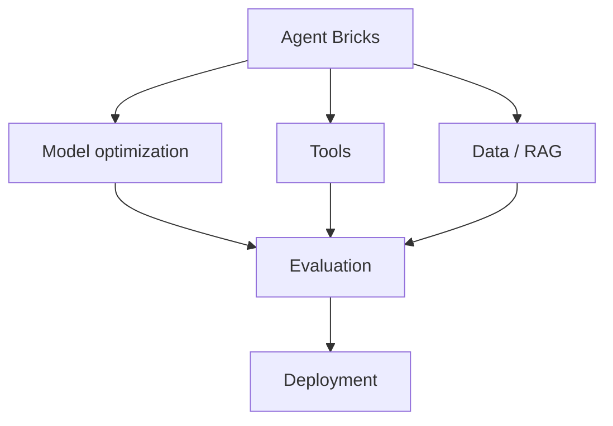
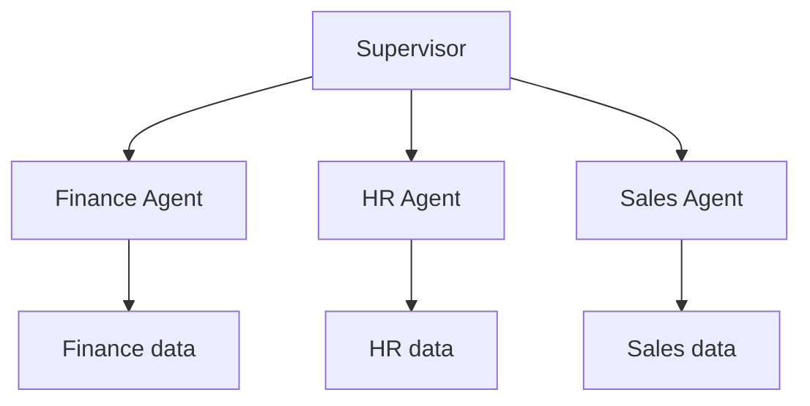

# Agent Bricks

Agent Bricks is Databricks' managed way to build and deploy domain-specific AI agents without having to build the entire agent architecture yourself.

It helps with things like agent creation, model selection and optimization, evaluation, and deployment, while integrating with the Databricks platform.

## Traditional Agent Development

```text
Your Code
   ↓
Choose LLM
   ↓
Build prompt
   ↓
Build RAG
   ↓
Build tools
   ↓
Build orchestration
   ↓
Evaluate
   ↓
Deploy
   ↓
Monitor
```

With Agent Bricks, Databricks manages much of that infrastructure:



## The Important Part

Agent Bricks has different "bricks".

As of the current Databricks documentation, Agent Bricks includes several specialized experiences.

## 1. Knowledge Assistant

This is probably the easiest one to understand.

You have:

```text
PDFs
DOCX
Policies
Manuals
Knowledge documents
       ↓
Knowledge Assistant
       ↓
RAG
       ↓
AI Agent
```

The agent can answer questions based on your organization's documents.

For example:

> What is our company's reimbursement policy for international travel?

The Knowledge Assistant retrieves relevant information and generates the answer.

## 2. Information Extraction

This is not primarily a chatbot.

Suppose you have 1 million invoices:

```text
Invoice PDF
     ↓
Agent Bricks
     ↓
Extract:
   Invoice Number
   Vendor
   Date
   Amount
   Tax
     ↓
Structured table
```

Databricks describes Information Extraction as transforming unstructured documents or text into structured insights using a schema you define.

This is useful for:

- invoices
- contracts
- legal documents
- customer documents
- forms

## 3. Classification

Suppose you have customer support conversations:

```text
Customer conversation
        ↓
Agent Bricks Classification
        ↓
Billing
Technical Issue
Refund
Account
Complaint
```

You provide the categories, and Agent Bricks classifies the documents or text.

## 4. Custom LLM

This is for tasks such as:

- Text
- Summarization
- Classification
- Transformation
- Generation

The interesting part is that Agent Bricks can help optimize prompts and models based on your examples and evaluation criteria, rather than requiring you to manually tune everything.

## 5. Supervisor Agent

This is where Agent Bricks becomes much more interesting.

Imagine you have:



The Supervisor Agent coordinates multiple agents and tools.

Databricks says it can coordinate Genie Agents, agent endpoints, Unity Catalog functions, MCP servers, and custom agents.